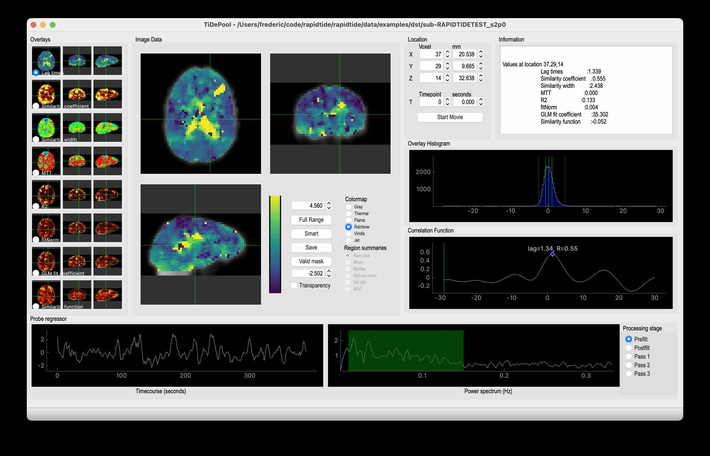

For more information about how the rapidtide library can be used, please
see the API page. Common rapidtide workflows can also be called from the
command line.

..
   Headings are organized in this manner:
   =====
   -----
   ^^^^^
   """""
   '''''

Background
----------
Before talking about the individual programs, in the 2.0 release and going
forward, I've tried to adhere to some common principals, across all program,
to make them easier to understand and maintain, and more interoperable
with other programs, and to simplify using the outputs.

NB: All commands are shown using backslashes as line continuation characters for clarity to make the commands easier to read.  These aren't needed - you can just put all the options on the same line, in any order.

BIDS Outputs
^^^^^^^^^^^^
By default, all outputs are in BIDS compatible formats (this is most true
for rapidtide and happy, which get the majority of the work, but the goal
is to eventually make all the programs in the package conform to this).  The
two major ramifications of this are that I have tried to follow BIDS naming
conventions for NIFTI, json, and text files containing time series.  Also,
all text files are by default BIDS continuous timeseries files - data is
in compressed, tab separated column format (.tsv.gz), with the column names,
sample rate, and start time, in the accompanying .json sidecar file.

Text Inputs
^^^^^^^^^^^
A side effect of moving to BIDS is that I've now made a standardized interface
for reading text data into programs in the package to handle many different
types of file.  In general, now if you
are asked for a timeseries, you can supply it in any of the following ways:

A plain text file with one or more columns.
"""""""""""""""""""""""""""""""""""""""""""
You can specify any subset of
columns in any order by adding ":colspec" to the end of the filename.  "colspec"
is a column specification consisting of one or more comma separated "column
ranges".  A "column range" is either a single column number or a hyphen
separated minimum and maximum column number.  The first column in a file is
column 0.

For example specifying, "mytextfile.txt:5-6,2,0,10-12"

would return an array containing all the timepoints from columns 5, 6, 2, 0, 10, 11, and 12
from mytextfile.txt, in that order.  Not specifying ":colspec" returns all
the columns in the file, in order.

If the program in question requires the actual sample rate, this can be specified
using the ``--samplerate`` or ``--sampletime`` flags.  Otherwise 1.0Hz is assumed.

A BIDS continuous file with one or more columns.
""""""""""""""""""""""""""""""""""""""""""""""""
BIDS files have names for each column, so these are used in column specification.
For these files, "colspec" is a comma separated list of one or more column
names:

"thefile_desc-interestingtimeseries_physio.json:cardiac,respiration"

would return the two named columns "cardiac" and "respiration" from the
accompanying .tsv.gz file.
Not specifying ":colspec" returns all the columns in the file, in order.

Because BIDS continuous files require sample rate and start time to be specified
in the sidecar file, these quantities will now already be set.  Using the
``--samplerate``, ``--sampletime`` or ``--starttime`` flags will override any header
values, if specified.

Visualizing files
^^^^^^^^^^^^^^^^^
Any output NIFTI file can be visualized in your favorite NIFTI viewer.  I like
FSLeyes, part of FSL.  It's flexible and fast, and has lots of options for
displaying 3 and 4D NIFTI files.

While there may be nice, general graphing tools for BIDS timeseries files, I
wrote "showtc" many years ago, a matplotlib based file viewer with lots of
nice tweaks to make pretty and informative graphs of various rapidtide input
and output files.  It's part of rapidtide, and pretty easy to learn.  Just
type "showtc" with no arguments to get the options.

As an example, after running happy, if you want to see the derived cardiac
waveform, you'd run:

::

  showtc \
      happytest_desc-slicerescardfromfmri_timeseries.json:cardiacfromfmri,cardiacfromfmri_dlfiltered \
      --format separate

rapidtide
---------

Description:
^^^^^^^^^^^^

The central program in this package is rapidtide.  This is the program that
calculates a similarity function between a "probe" signal and every voxel of
a BOLD fMRI dataset.  It then determines the peak value, time delay, and wi
dth of the similarity function to determine when and how strongly that probe
signal appears in each voxel.

At its core, rapidtide is simply performing a full crosscorrelation between a
"probe" timecourse and every voxel in an fMRI dataset (by “full” I mean over
a range of time lags that account for any delays between the signals, rather
than only at zero lag, as in a Pearson correlation).  As with many things,
however, the devil is in the details, and so rapidtide provides a number of
features which make it pretty good at this particular task.  A few highlights:

* There are lots of ways to do something even as simple as a cross-correlation in a nonoptimal way (not windowing, improper normalization, doing it in the time rather than frequency domain, etc.).  I'm pretty sure what rapidtide does by default is, if not the best way, at least a very good and very fast way.
* rapidtide has been optimized and profiled to speed it up quite a bit; it has an optional dependency on numba – if it’s installed, some of the most heavily used routines will speed up significantly due to judicious use of @jit.
* The sample rate of your probe regressor and the fMRI data do not have to match - rapidtide resamples the probe regressor to an integral multiple of the fMRI data rate automatically.
* The probe and data can be temporally prefiltered to the LFO, respiratory, or cardiac frequency band with a command line switch, or you can specify any low, high, or bandpass range you want.
* The data can be spatially smoothed at runtime (so you don't have to keep smoothed versions of big datasets around).  This is quite fast, so no reason not to do it this way.
* rapidtide can generate a probe regressor from the global mean of the data itself - no externally recorded timecourse is required.  Optionally you can input both a mask of regions that you want to be included in the mean, and the voxels that you want excluded from the mean (there are situations when you might want to do one or the other or both).
* Determining the significance threshold for filtered correlations where the optimal delay has been selected is nontrivial; using the conventional formulae for the significance of a correlation leads to wildly inflated p values.  rapidtide estimates the spurious correlation threshold by calculating the distribution of null correlation values obtained with a shuffling  procedure at the beginning of each run (the default is to use 10000 shuffled correlations), and uses this value to mask the correlation maps it calculates.  As of version 0.1.2 it will also handle two-tailed significance, which you need when using bipolar mode.
* rapidtide can do an iterative refinement of the probe regressor by aligning the voxel timecourses in time and regenerating the test regressor.
* rapidtide fits the peak of the correlation function, so you can make fine grained distinctions between close lag times. The resolution of the time lag discrimination is set by the length of the timecourse, not the timestep – this is a feature of correlations, not rapidtide.
* Once the time delay in each voxel has been found, rapidtide outputs a 4D file of delayed probe regressors for using as voxel specific confound regressors or to estimate the strength of the probe regressor in each voxel.  This regression is performed by default, but these outputs let you do it yourself if you are so inclined.
* I've put a lot of effort into making the outputs as informative as possible - lots of useful maps, histograms, timecourses, etc.
* There are a lot of tuning parameters you can mess with if you feel the need.  I've tried to make intelligent defaults so things will work well out of the box, but you have the ability to set most of the interesting parameters yourself.

Inputs:
^^^^^^^

At a minimum, rapidtide needs a data file to work on (space by time), which is generally thought to be a BOLD fMRI data file.  This can be Nifti1 or Nifti2 (for fMRI data, in which case it is time by up to 3 spatial dimensions) or a whitespace separated text file (for NIRS data, each column is a time course, each row a separate channel); I can currently read (probably) but not write Cifti files, so if you want to use grayordinate files you need to convert them to nifti2 in workbench, run rapidtide, then convert back. As soon as nibabel finishes their Cifti support (EDIT: and I get around to figuring it out), I'll add that.

The file needs one time dimension and at least one spatial dimension.  Internally, the array is flattened to a time by voxel array for simplicity.

The file you input here should be the result of any preprocessing you intend to do.  The expectation is that rapidtide will be run as the last preprocessing step before resting state or task based analysis.  So any slice time correction, motion correction, spike removal, etc. should already have been done.  If you use FSL, this means that if you've run preprocessing, you would use the filtered_func_data.nii.gz file as input.  Temporal and spatial filtering are the two (partial) exceptions here.  Generally rapidtide is most useful for looking at low frequency oscillations, so when you run it, you usually use the ``--filterband lfo`` option or some other to limit the analysis to the detection and removal of low frequency systemic physiological oscillations.  So rapidtide will generally apply it's own temporal filtering on top of whatever you do in preprocessing.  Also, you have the option of doing spatial smoothing in rapidtide to boost the SNR of the analysis; the hemodynamic signals rapidtide looks for are often very smooth, so you rather than smooth your functional data excessively, you can do it within rapidtide so that only the hemodynamic data is smoothed at that level.

Outputs:
^^^^^^^^

Outputs are space or space by time NIFTI or text files, depending on what the input data file was, and some text files containing textual information, histograms, or numbers.  File formats and naming follow BIDS conventions for derivative data for fMRI input data.  Output spatial dimensions and file type match the input dimensions and file type (Nifti1 in, Nifti1 out).  Depending on the file type of map, there can be no time dimension, a time dimension that matches the input file, or something else, such as a time lag dimension for a correlation map.

BIDS Outputs:
^^^^^^^^^^^^^

.. csv-table::
   :header: "Name", "Extension(s)", "Content", "When present"
   :widths: 15, 15, 30, 10

   "XXX_maxtime_map", ".nii.gz, .json", "Time of offset of the maximum of the similarity function", "Always"
   "XXX_desc-maxtime_hist", ".tsv, .json", "Histogram of the maxtime map", "Always"
   "XXX_maxcorr_map", ".nii.gz, .json", "Maximum similarity function value (usually the correlation coefficient, R)", "Always"
   "XXX_desc-maxcorr_hist", ".tsv, .json", "Histogram of the maxcorr map", "Always"
   "XXX_maxcorrsq_map", ".nii.gz, .json", "Maximum similarity function value, squared", "Always"
   "XXX_desc-maxcorrsq_hist", ".tsv, .json", "Histogram of the maxcorrsq map", "Always"
   "XXX_maxwidth_map", ".nii.gz, .json", "Width of the maximum of the similarity function", "Always"
   "XXX_desc-maxwidth_hist", ".tsv, .json", "Histogram of the maxwidth map", "Always"
   "XXX_MTT_map", ".nii.gz, .json", "Mean transit time (estimated)", "Always"
   "XXX_corrfit_mask", ".nii.gz", "Mask showing where the similarity function fit succeeded", "Always"
   "XXX_corrfitfailreason_map", ".nii.gz, .json", "A numerical code giving the reason a peak could not be found (0 if fit succeeded)", "Always"
   "XXX_desc-corrfitwindow_info", ".nii.gz", "Values used for correlation peak fitting", "Always"
   "XXX_desc-runoptions_info", ".json", "A detailed dump of all internal variables in the program.  Useful for debugging and data provenance", "Always"
   "XXX_desc-lfofilterCleaned_bold", ".nii.gz, .json", "Filtered BOLD dataset after removing moving regressor", "If GLM filtering is enabled (default)"
   "XXX_desc-lfofilterRemoved_bold", ".nii.gz, .json", "Scaled, voxelwise delayed moving regressor that has been removed from the dataset", "If GLM filtering is enabled (default) and ``--nolimitoutput`` is selected"
   "XXX_desc-lfofilterEVs_bold", ".nii.gz, .json", "Voxel specific delayed sLFO regressors used as EVs for the GLM", "If GLM filtering is enabled (default) and ``--nolimitoutput`` is selected"
   "XXX_desc-lfofilterCoeff_map", ".nii.gz, .json", "Magnitude of the delayed sLFO regressor from GLM filter", "If GLM filtering is enabled (default)"
   "XXX_desc-lfofilterMean_map", ".nii.gz, .json", "Mean value over time, from GLM fit", "If GLM filtering is enabled (default)"
   "XXX_desc-lfofilterNorm_map", ".nii.gz, .json", "GLM filter coefficient, divided by the voxel mean over time", "If GLM filtering is enabled (default)"
   "XXX_desc-lfofilterR_map", ".nii.gz, .json", "R value for the GLM fit in the voxel", "If GLM filtering is enabled (default)"
   "XXX_desc-lfofilterR2_map", ".nii.gz, .json", "R value for the GLM fit in the voxel, squared. Multiply by 100 to get percentage variance explained", "If GLM filtering is enabled (default)"
   "XXX_desc-CVR_map", ".nii.gz, .json", "Cerebrovascular response, in units of % BOLD per unit of the supplied regressor (probably mmHg)", "If CVR mapping is enabled"
   "XXX_desc-CVRR_map", ".nii.gz, .json", "R value for the CVR map fit in the voxel", "If CVR mapping is enabled"
   "XXX_desc-CVRR2_map", ".nii.gz, .json", "R value for the CVR map fit in the voxel, squared. Multiply by 100 to get percentage variance explained", "If CVR mapping is enabled"
   "XXX_desc-processed_mask", ".nii.gz", "Mask of all voxels in which the similarity function is calculated", "Always"
   "XXX_desc-globalmean_mask", ".nii.gz", "Mask of voxels used to calculate the global mean signal", "This file will exist if no external regressor is specified"
   "XXX_desc-refine_mask", ".nii.gz", "Mask of voxels used in the last estimate a refined version of the probe regressor", "Present if passes > 1"
   "XXX_desc-shiftedtcs_bold", ".nii.gz", "The filtered input fMRI data, in voxels used for refinement, time shifted by the negated delay in every voxel so that the moving blood component should be aligned.", "Present if passes > 1 and ``--nolimitoutput`` is selected"
   "XXX_desc-despeckle_mask", ".nii.gz", "Mask of the last set of voxels that had their time delays adjusted due to autocorrelations in the probe regressor", "Present if despecklepasses > 0"
   "XXX_desc-corrout_info", ".nii.gz", "Full similarity function over the search range", "Always"
   "XXX_desc-gaussout_info", ".nii.gz", "Gaussian fit to similarity function peak over the search range", "Always"
   "XXX_desc-autocorr_timeseries", ".tsv, .json", "Autocorrelation of the probe regressor for each pass", "Always"
   "XXX_desc-corrdistdata_info", ".tsv, .json", "Null correlations from the significance estimation for each pass", "Present if ``--numnull`` > 0"
   "XXX_desc-nullsimfunc_hist", ".tsv, .json", "Histogram of the distribution of null correlation values for each pass", "Present if ``--numnull`` > 0"
   "XXX_desc-plt0p050_mask", ".nii.gz", "Voxels where the maxcorr value exceeds the p < 0.05 significance level", "Present if ``--numnull`` > 0"
   "XXX_desc-plt0p010_mask", ".nii.gz", "Voxels where the maxcorr value exceeds the p < 0.01 significance level", "Present if ``--numnull`` > 0"
   "XXX_desc-plt0p005_mask", ".nii.gz", "Voxels where the maxcorr value exceeds the p < 0.005 significance level", "Present if ``--numnull`` > 0"
   "XXX_desc-plt0p001_mask", ".nii.gz", "Voxels where the maxcorr value exceeds the p < 0.001 significance level", "Present if ``--numnull`` > 0"
   "XXX_desc-globallag_hist", ".tsv, .json", "Histogram of peak correlation times between probe and all voxels, over all time lags, for each pass", "Always"
   "XXX_desc-initialmovingregressor_timeseries", ".tsv, .json", "The raw and filtered initial probe regressor, at the original sampling resolution", "Always"
   "XXX_desc-movingregressor_timeseries", ".tsv, .json", "The probe regressor used in each pass, at the time resolution of the data", "Always"
   "XXX_desc-oversampledmovingregressor_timeseries", ".tsv, .json", "The probe regressor used in each pass, at the time resolution used for calculating the similarity function", "Always"
   "XXX_desc-refinedmovingregressor_timeseries", ".tsv, .json", "The raw and filtered probe regressor produced by the refinement procedure, at the time resolution of the data", "Present if passes > 1"
..

Usage:
^^^^^^

.. argparse::
   :ref: rapidtide.workflows.rapidtide_parser._get_parser
   :prog: rapidtide
   :func: _get_parser

Examples:
^^^^^^^^^

Rapidtide can do many things - as I've found more interesting things to do with time delay processing, it's gained new functions and options to support these new applications.  As a result, it can be a little hard to know what to use for a new experiment.  To help with that, I've decided to add this section to the manual to get you started.  It's broken up by type of data/analysis you might want to do.

NB: To speed up the analysis, adding the argument ``--nprocs XX`` to any of the following commands will parallelize the analysis to use XX CPUs - set XX to -1 to use all available CPUs.  This can result in a speedup approaching a factor of the number of CPUs used.

Preprocessing
"""""""""""""
Rapidtide operates on data which has been subjected to all the "standard" preprocessing steps, most importantly motion correction and slice time correction.  Since rapidtide

Removing low frequency physiological noise from fMRI data
"""""""""""""""""""""""""""""""""""""""""""""""""""""""""

This is what I figure most people will use rapidtide for - finding and removing the low frequency (LFO) signal from an existing dataset (including the case where the signal grows over time https://www.biorxiv.org/content/10.1101/2023.09.08.556939v2 ).  This presupposes you have not made a simultaneous physiological recording (well, you may have, but it assumes you aren't using it).  For this, you can use a minimal set of options, since the defaults are set to be generally optimal for noise removal.

The base command you'd use would be:

	::

		rapidtide \
		    inputfmrifile \
		    outputname \
		    --denoising

This will do a the default analysis (but each and every particular can be changed by adding command line options).  By default, rapidtide will:

    #. Prefilter the data to the LFO band (0.009-0.15Hz).

    #. Construct a probe regressor from the global mean of the signal in inputfmrifile (default behavior if no regressor or selections masks are specified).

    #. Do three passes through the data.  In each step, rapidtide will:

        #. Perform a crosscorrelation of each voxel with the probe regressor using the "regressor" weighting.

        #. Estimate the location and strength of the correlation peak using the correlation similarity metric within a range of +/-10 seconds around around the modal delay value.

        #. Generate a new estimate of the global noise signal by:

            #. Aligning all of the voxel timecourses to bring the global signal into phase,

            #. Performing a PCA analysis,

            #. Reconstructing each timecourse using the PCA components accounting for 80% of the signal variance in the aligned voxel timecourses,

            #. Averaging the reconstructed timecourses to produce a new probe regressor,

            #. Applying an offset to the recenter the peak of the delay distribution of all voxels to zero, which should make datasets easier to compare.

    #. After the three passes are complete, rapidtide will then use a GLM filter to remove a voxel specific lagged copy of the final probe regressor from the data - this denoised data will be in the file ``outputname_desc-lfofilterCleaned_bold.nii.gz``.  There will also a number of maps output with the prefix ``outputname_`` of delay, correlation strength and so on.  See the :ref:`BIDS Outputs` table above for specifics.

Please note that rapidtide plays happily with AROMA, so you don't need to do anything special to process data that's been run through AROMA.  While FIX and AROMA both use spatiotemporal analysis of independent components to determine what components to remove, AROMA only targets ICs related to motion, which are quite distinct from the sLFO signal, so they don't interfere with each other.  In contrast, FIX targets components that are "bad", for multiple definitions of the term, which includes some purely hemodynamic components near the back of the brain.  As a result, FIX denoising impedes the operation of rapidtide.  See below.

Removing low frequency physiological noise from fMRI data that has been processed with FIX
""""""""""""""""""""""""""""""""""""""""""""""""""""""""""""""""""""""""""""""""""""""""""

There is a special case if you are working on HCP data, which has both minimally processed and a fully processed (including FIX denoising) data files.  FIX denoising is a good thing, but it tends to distort the sLFO signals that rapidtide is looking for, so the selection and refinement of the sLFO can wander off into the thicket if applied to FIX processed data.  So ideally, you would run rapidtide, and THEN FIX.  However, since reprocessing the HCP data is kind of a pain, there's a hack that capitalizes on the fact that all of these operations are linear.  You run rapidtide on the minimmally processed data, to accurately assess the sLFO regressor and time delays in each voxel, but you apply the final GLM to the FIX processed data, to remove the data that has the other denoising already done.  This works very well!  To do this, you use the ``--glmsourcefile FILE`` option to specify the file you want to denoise.  The ``outputname_desc-lfofilterCleaned_bold.nii.gz`` file is the FIX file, with rapidtide denoising applied.

	::

		rapidtide \
		    minimallyprocessedinputfmrifile \
		    outputname \
		    --denoising \
		    --glmsourcefile FIXprocessedfile

Mapping long time delays in response to a gas challenge experiment:
"""""""""""""""""""""""""""""""""""""""""""""""""""""""""""""""""""

Processing this sort of data requires a very different set of options from the previous case.  Instead of the distribution of delays you expect in healthy controls (a slightly skewed, somewhat normal distribution with a tail on the positive side, ranging from about -5 to 5 seconds), in this case, the maximum delay can be extremely long (100-120 seconds is not uncommon in stroke, moyamoya disesase, and atherosclerosis).  To do this, you need to radically change what options you use, not just the delay range, but a number of other options having to do with refinement and statistical measures.

For this type of analysis, a good place to start is the following:

	::

		rapidtide \
		    inputfmrifile \
		    outputname \
		    --numnull 0 \
		    --searchrange -10 140 \
		    --filterfreqs 0.0 0.1 \
		    --ampthresh 0.2 \
		    --noglm \
		    --nofitfilt

The first option (``--numnull 0``), shuts off the calculation of the null correlation distribution.  This is used to determine the significance threshold, but the method currently implemented in rapidtide is a bit simplistic - it assumes that all the time points in the data are exchangable.  This is certainly true for resting state data (see above), but it is very much NOT true for block paradigm gas challenges.  To properly analyze those, I need to consider what time points are 'equivalent', and up to now, I don't, so setting the number of iterations in the Monte Carlo analysis to zero omits this step.

The second option (``--searchrange -10 140``) is fairly obvious - this extends the detectable delay range out to 140 seconds.  Note that this is somewhat larger than the maximum delays we frequently see, but to find the correlation peak with maximum precision, you need sufficient additional delay values so that the correlation can come to a peak and then come down enough that you can properly fit it.  Obviously adjust this as needed for your experiment, to fit the particulars of your gas challenge waveform and/or expected pathology.

Setting ``--filterfreqs 0.0 0.1`` is VERY important.  By default, rapidtide assumes you are looking at endogenous low frequency oscillations, which typically between 0.09 and 0.15 Hz.  However, gas challenge paradigms are usually MUCH lower frequency (90 seconds off, 90 seconds on corresponds to 1/180s = ~0.006Hz).  So if you use the default frequency settings, you will completely filter out your stimulus, and presumably, your response.  If you are processing one of these experiments and get no results whatsoever, this is almost certainly the problem.

The ``--noglm`` option disables data filtering.  If you are using rapidtide to estimate and remove low frequency noise from resting state or task fMRI data, the last step is to use a glm filter to remove this circulatory signal, leaving "pure" neuronal signal, which you'll use in further analyses.  That's not relevant here - the signal you'd be removing is the one you care about. So this option skips that step to save time and disk space.

``--nofitfilt`` skips a step after peak estimation.  Estimating the delay and correlation amplitude in each voxel is a two step process. First you make a quick estimate (where is the maximum point of the correlation function, and what is its amplitude?), then you refine it by fitting a Gaussian function to the peak to improve the estimate.  If this step fails, which it can if the peak is too close to the end of the lag range, or strangely shaped, the default behavior is to mark the point as bad and zero out the parameters for the voxel.  The nofitfilt option means that if the fit fails, output the initial estimates rather than all zeros.   This means that you get some information, even if it's not fully refined.  In my experience it does tend to make the maps for the gas challenge experiments a lot cleaner to use this option since the correlation function is pretty well behaved.

CVR mapping:
""""""""""""

This is a slightly different twist on interpreting the strength of the lagged correlation.  In this case, you supply an input regressor that corresponds to a measured, calibrated CO2 quantity (for example, etCO2 in mmHg).  Rapidtide then does a modified analysis - it still uses the cross-correlation to find when the input regressor is maximally aligned with the variance in the voxel signal, but instead of only returning a correlation strength, it calculates the percentage BOLD change in each voxel in units of the input regressor (e.g. %BOLD/mmHg), which is the standard in CVR analysis.

	::

		rapidtide \
		    inputfmrifile \
		    outputname \
		    --regressor regressorfile \
		    --CVR

You invoke this with the ``--CVR`` option.  This is a macro that does a lot of things: I disabled refinement, hijacked the GLM filtering routine, and messed with some normalizations.  If you want to refine your regressor estimate, or filter the sLFO signal out of your data, you need to do a separate analysis.

You also need to supply the regressor using ``--regressor regressorfile``.  If regressorfile is a bids tsv/json pair, this will have the sample rate and offset specified.  If the regressor file has sample rate other than the fMRI TR, or a non-zero offset relative to the fMRI data, you will also need to specify these parameters using ``--regressorfreq FREQ`` or ``--regressortstep TSTEP`` and/or ``--regressorstart START``.

Denoising NIRS data:
""""""""""""""""""""

When we started this whole research effort, I waw originally planning to denoise NIRS data, not fMRI data.  But one thing led to another, and the NIRS got derailed for the fMRI effort.  Now that we have some time to catch our breaths, and more importantly, we have access to some much higher quality NIRS data, this moved back to the front burner.  The majority of the work was already done, I just needed to account for a few qualities that make NIRS data different from fMRI data:

* NIRS data is not generally stored in NIFTI files.  There is not as yet a standard NIRS format.  In the absence of one, you could do worse than a multicolumn text file, with one column per data channel.  That's what I did here - if the file has a '.txt' extension rather than '.nii.', '.nii.gz', or no extension, it will assume all I/O should be done on multicolumn text files.
* NIRS data is often zero mean.  This turned out to mess with a lot of my assumptions about which voxels have significant data, and mask construction.  This has led to some new options for specifying mask threshholds and data averaging.
* NIRS data is in some sense "calibrated" as relative micromolar changes in oxy-, deoxy-, and total hemoglobin concentration, so mean and/or variance normalizing the timecourses may not be right thing to do.  I've added in some new options to mess with normalizations.

happy
-----

Description:
^^^^^^^^^^^^

happy is a new addition to the rapidtide suite.  It's complementary to rapidtide - it's focussed on fast, cardiac signals in fMRI, rather than the slow, LFO signals we are usually looking at.  It's sort of a Frankenprogram - it has three distinct jobs, which are related, but are very distinct.

The first thing happy does is try to extract a cardiac waveform from the fMRI data.  This is something I've been thinking about for a long time.  Words go here

The second task is to take this raw estimate of the cardiac waveform, and clean it up using a deep learning filter.  The original signal is useful, but pretty gross, but I figured you should be able to exploit the pseudoperiodic nature of the signal to greatly improve it.  This is also a testbed to work on using neural nets to process time domain signals.  It seemed like a worthwhile project, so it got grafted in.

The final task (which was actually the initial task, and the reason I wrote happy to begin with) is to implement Henning Voss' totally cool hypersampling with analytic phase projection (guess where the name "happy" comes from).  This is fairly straightforward, as Voss describes his method very clearly.  But I have lots of data with no simultaneously recorded cardiac signals, and I was too lazy to go find datasets with pleth data to play with, so that's why I did the cardiac waveform extraction part.

Inputs:
^^^^^^^
Happy needs a 4D BOLD fMRI data file (space by time) as input.  This can be Nifti1 or Nifti2.  If you have a simultaneously recorded cardiac waveform, it will happily use it, otherwise it will try to construct (and refine) one. NOTE: the 4D input dataset needs to be completely unpreprocessed - gradient distortion correction and motion correction can destroy the relationship between slice number and actual acquisition time, and slice time correction does not behave as expected for aliased signals (which the cardiac component in fMRI most certainly is), and in any case we need the slice time offsets to construct our waveform.

Outputs:
^^^^^^^^

Outputs are space or space by time Nifti or text files, depending on what the input data file was, and some text files containing textual information, histograms, or numbers.  File formats and naming follow BIDS conventions for derivative data for fMRI input data.  Output spatial dimensions and file type match the input dimensions and file type (Nifti1 in, Nifti1 out).  Depending on the file type of map, there can be no time dimension, a time dimension that matches the input file, or something else, such as a time lag dimension for a correlation map.

BIDS Outputs:
^^^^^^^^^^^^^

.. csv-table::
   :header: "Name", "Extension(s)", "Content", "When present"
   :widths: 15, 15, 30, 10

   "XXX_commandline", ".txt", "The command line used to run happy", "Always"
   "XXX_formattedcommandline", ".txt", "The command line used to run happy, attractively formatted", "Always"
   "XXX_desc-rawapp_info", ".nii.gz", "The analytic phase projection map of the cardiac waveform", "Always"
   "XXX_desc-app_info", ".nii.gz", "The analytic phase projection map of the cardiac waveform, voxelwise minimum subtracted", "Always"
   "XXX_desc-normapp_info", ".nii.gz", "The analytic phase projection map of the cardiac waveform, voxelwise minimum subtracted and normalized", "Always"
   "XXX_desc-apppeaks_hist", ".tsv.gz, .json", "Not sure", "Always"
   "XXX_desc-apppeaks_hist_centerofmass", ".txt", "Not sure", "Always"
   "XXX_desc-apppeaks_hist_peak", ".txt", "Not sure", "Always"
   "XXX_desc-slicerescardfromfmri_timeseries", ".tsv.gz, .json", "Cardiac timeseries at the time resolution of slice acquisition ((1/TR * number of slices / multiband factor", "Always"
   "XXX_desc-stdrescardfromfmri_timeseries", ".tsv.gz, .json", "Cardiac timeseries at standard time resolution (25.O Hz)", "Always"
   "XXX_desc-cardpulsefromfmri_timeseries", ".tsv.gz, .json", "The average (over time from minimum) of the cardiac waveform over all voxels", "Always"
   "XXX_desc-cardiaccyclefromfmri_timeseries", ".tsv.gz, .json", "The average (over a single cardiac cycle) of the cardiac waveform over all voxels", "Always"
   "XXX_desc-cine_info", ".nii.gz", "Average image of the fMRI data over a single cardiac cycle", "Always"
   "XXX_desc-cycleaverage_timeseries", ".tsv.gz, .json", "Not sure", "Always"
   "XXX_desc-maxphase_map", ".nii.gz", "Map of the average phase where the maximum amplitude occurs for each voxel", "Always"
   "XXX_desc-minphase_map", ".nii.gz", "Map of the average phase where the minimum amplitude occurs for each voxel", "Always"
   "XXX_desc-processvoxels_mask", ".nii.gz", "Map of all voxels used for analytic phase projection", "Always"
   "XXX_desc-vessels_map", ".nii.gz", "Amplitude of variance over a cardiac cycle (large values are assumed to be vessels)", "Always"
   "XXX_desc-vessels_mask", ".nii.gz", "Locations of voxels with variance over a cardiac cycle that exceeds a threshold (assumed to be vessels)", "Always"
   "XXX_desc-arteries_map", ".nii.gz", "High variance vessels with early maximum values within the cardiac cycle", "Always"
   "XXX_desc-veins_map", ".nii.gz", "High variance vessels with late maximum values within the cardiac cycle", "Always"
   "XXX_info", ".json", "Run parameters and derived values found during the run (quality metrics, derived thresholds, etc.)", "Always"
   "XXX_memusage", ".csv", "Memory statistics at multiple checkpoints over the course of the run", "Always"
   "XXX_runtimings", ".txt", "Detailed timing information", "Always"
..

Usage:
^^^^^^

.. argparse::
   :ref: rapidtide.workflows.happy_parser._get_parser
   :prog: happy
   :func: _get_parser

   Debugging options : @skip
      skip debugging options

Example:
^^^^^^^^^

Extract the cardiac waveform and generate phase projections
"""""""""""""""""""""""""""""""""""""""""""""""""""""""""""

Case 1: When you don't have a pleth recording
'''''''''''''''''''''''''''''''''''''''''''''
There are substantial improvements to the latest versions of happy.
In the old versions, you actually had to run happy twice -
the first time to estimate the vessel locations, and the second
to actually derive the waveform.  Happy now combines these operations interpolation
a single run with multiple passes - the first
pass locates voxels with high variance, labels them as vessels, then reruns
the derivation, restricting the cardiac estimation to these high variance voxels.
This gives substantially better results.

Using the example data in the example directory, try the following:

  ::

    happy \
        rapidtide/data/examples/src/sub-HAPPYTEST.nii.gz \
        rapidtide/data/examples/src/sub-HAPPYTEST.json \
        rapidtide/data/examples/dst/happytest

This will perform a happy analysis on the example dataset.  To see the extracted
cardiac waveform (original and filtered), you can use showtc (also part of them
rapidtide package):

  ::

    showtc \
        rapidtide/data/examples/src/happytest_desc-slicerescardfromfmri_timeseries.json:cardiacfromfmri,cardiacfromfmri_dlfiltered \
        --format separate

rapidtide2std
-------------

Description:
^^^^^^^^^^^^

	This is a utility for registering rapidtide output maps
	to standard coordinates.  It's usually much faster to run rapidtide
	in native space then transform afterwards to MNI152 space.  NB: this
	will only work if you have a working FSL installation.

Inputs:
^^^^^^^

Outputs:
^^^^^^^^
	New versions of the rapidtide output maps, registered to either MNI152 space or to the hires anatomic images for the subject.  All maps are named with the specified root name with '_std' appended.

Usage:
^^^^^^

.. argparse::
   :ref: rapidtide.scripts.rapidtide2std._get_parser
   :prog: rapidtide2std
   :func: _get_parser

showxcorr_legacy
----------------

Description:
^^^^^^^^^^^^

	Like rapidtide, but for single time courses.  Takes two text files as input, calculates and displays
	the time lagged crosscorrelation between them, fits the maximum time lag, and estimates
	the significance of the correlation.  It has a range of filtering,
	windowing, and correlation options.  This is the old interface - for new analyses you should use showxcorrx.

Inputs:
^^^^^^^
	showxcorr requires two text files containing timecourses with the same sample rate, one timepoint per line, which are to be correlated, and the sample rate.

Outputs:
^^^^^^^^
	showxcorr outputs everything to standard out, including the Pearson correlation, the maximum cross correlation, the time of maximum cross correlation, and estimates of the significance levels (if specified).  There are no output files.

Usage:
^^^^^^

	::

		usage: showxcorr timecourse1 timecourse2 samplerate [-l LABEL] [-s STARTTIME] [-D DURATION] [-d] [-F LOWERFREQ,UPPERFREQ[,LOWERSTOP,UPPERSTOP]] [-V] [-L] [-R] [-C] [-t] [-w] [-f] [-z FILENAME] [-N TRIALS]

		required arguments:
			timcoursefile1:	text file containing a timeseries
			timcoursefile2:	text file containing a timeseries
			samplerate:	the sample rate of the timecourses, in Hz

		optional arguments:
		    -t            - detrend the data
		    -w            - prewindow the data
		    -l LABEL      - label for the delay value
		    -s STARTTIME  - time of first datapoint to use in seconds in the first file
		    -D DURATION   - amount of data to use in seconds
		    -r RANGE      - restrict peak search range to +/- RANGE seconds (default is
				    +/-15)
		    -d            - turns off display of graph
		    -F            - filter data and regressors from LOWERFREQ to UPPERFREQ.
				    LOWERSTOP and UPPERSTOP can be specified, or will be
				    calculated automatically
		    -V            - filter data and regressors to VLF band
		    -L            - filter data and regressors to LFO band
		    -R            - filter data and regressors to respiratory band
		    -C            - filter data and regressors to cardiac band
		    -T            - trim data to match
		    -A            - print data on a single summary line
		    -a            - if summary mode is on, add a header line showing what values
				    mean
		    -f            - negate (flip) second regressor
		    -z FILENAME   - use the columns of FILENAME as controlling variables and
				    return the partial correlation
		    -N TRIALS     - estimate significance thresholds by Monte Carlo with TRIALS
				    repetition

showxcorrx
----------

Description:
^^^^^^^^^^^^

	This is the newest, most avant-garde version of showxcorr.  Because it's an x file, it's more fluid and I don't guarantee that it will keep a stable interface (or even work at any given time).  But every time I add something new, it goes here.  The goal is eventually to make this the "real" version.  Unlike rapidtide, however, I've let it drift quite a bit without syncing it because some people here actually use showxcorr and I don't want to disrupt workflows...

Inputs:
^^^^^^^
	showxcorrx requires two text files containing timecourses with the same sample rate, one timepoint per line, which are to be correlated, and the sample rate.

Outputs:
^^^^^^^^
	showxcorrx  outputs everything to standard out, including the Pearson correlation, the maximum cross correlation, the time of maximum cross correlation, and estimates of the significance levels (if specified).  There are no output files.

Usage:
^^^^^^

.. argparse::
   :ref: rapidtide.workflows.showxcorrx._get_parser
   :prog: showxcorrx
   :func: _get_parser

   Debugging options : @skip
      skip debugging options

showtc
------

Description:
^^^^^^^^^^^^
	A very simple command line utility that takes a text file
	and plots the data in it in a matplotlib window.  That's it.  A
	good tool for quickly seeing what's in a file.  Has some options
	to make the plot prettier.

Inputs:
^^^^^^^
	Text files containing time series data

Outputs:
^^^^^^^^
	None

Usage:
^^^^^^

.. argparse::
   :ref: rapidtide.workflows.showtc._get_parser
   :prog: showtc
   :func: _get_parser

   Debugging options : @skip
      skip debugging options

glmfilt
-------

Description:
^^^^^^^^^^^^
Uses a GLM filter to remove timecourses (1D text files or 4D NIFTI files) from 4D NIFTI files.

Inputs:
^^^^^^^

Outputs:
^^^^^^^^

Usage:
^^^^^^

.. argparse::
   :ref: rapidtide.workflows.glmfilt._get_parser
   :prog: glmfilt
   :func: _get_parser

   Debugging options : @skip
      skip debugging options

temporaldecomp
--------------

Description:
^^^^^^^^^^^^

Inputs:
^^^^^^^

Outputs:
^^^^^^^^

Usage:
^^^^^^

.. argparse::
   :ref: rapidtide.workflows.niftidecomp._get_parser_temporal
   :prog: temporaldecomp
   :func: _get_parser_temporal

   Debugging options : @skip
      skip debugging options

spatialdecomp
-------------

Description:
^^^^^^^^^^^^

Inputs:
^^^^^^^

Outputs:
^^^^^^^^

Usage:
^^^^^^

.. argparse::
   :ref: rapidtide.workflows.niftidecomp._get_parser_spatial
   :prog: spatialdecomp
   :func: _get_parser_spatial

   Debugging options : @skip
      skip debugging options

polyfitim
---------

Description:
^^^^^^^^^^^^

Inputs:
^^^^^^^

Outputs:
^^^^^^^^

Usage:
^^^^^^

.. argparse::
   :ref: rapidtide.workflows.polyfitim._get_parser
   :prog: polyfitim
   :func: _get_parser

   Debugging options : @skip
      skip debugging options

histnifti
---------

Description:
^^^^^^^^^^^^
	A command line tool to generate a histogram for a nifti file

Inputs:
^^^^^^^
	A nifti file

Outputs:
^^^^^^^^
	A text file containing the histogram information

None

Usage:
^^^^^^

.. argparse::
   :ref: rapidtide.workflows.histnifti._get_parser
   :prog: histnifti
   :func: _get_parser

   Debugging options : @skip
      skip debugging options

showhist
--------

Description:
^^^^^^^^^^^^
	Another simple command line utility that displays the histograms generated by rapidtide.

Inputs:
^^^^^^^
	A textfile generated by rapidtide containing histogram information

Outputs:
^^^^^^^^
	None

Usage:
^^^^^^

	::

		usage: showhist textfilename
			plots xy histogram data in text file

		required arguments:
			textfilename	- a text file containing one timepoint per line

resamp1tc
---------

Description:
^^^^^^^^^^^^
	This takes an input text file at some sample rate and outputs a text file resampled to the specified sample rate.

Inputs:
^^^^^^^

Outputs:
^^^^^^^^

Usage:
^^^^^^

	::

		resamp1tc - resample a timeseries file

		usage: resamp1tc infilename insamplerate outputfile outsamplerate [-s]

		required arguments:
			inputfile        - the name of the input text file
			insamplerate     - the sample rate of the input file in Hz
			outputfile       - the name of the output text file
			outsamplerate    - the sample rate of the output file in Hz

		 options:
			-s               - split output data into physiological bands (LFO, respiratory, cardiac)

resamplenifti
-------------

Description:
^^^^^^^^^^^^
	This takes an input nifti file at some TR and outputs a nifti file resampled to the specified TR.

Inputs:
^^^^^^^

Outputs:
^^^^^^^^

Usage:
^^^^^^

.. argparse::
   :ref: rapidtide.workflows.resamplenifti._get_parser
   :prog: resamplenifti
   :func: _get_parser

   Debugging options : @skip
      skip debugging options

tcfrom3col
----------

Description:
^^^^^^^^^^^^
	A  simple command line that takes an FSL style 3 column regressor file and generates a time course (waveform) file.  FSL 3 column files are text files containing one row per "event".  Each row has three columns: start time in seconds, duration in seconds, and waveform value.  The output waveform is zero everywhere that is not covered by an "event" in the file.

Inputs:
^^^^^^^
	An FSL style three column text file (start time, duration, value)

Outputs:
^^^^^^^^
	A single column text file containing the waveform

Usage:
^^^^^^

.. argparse::
   :ref: rapidtide.workflows.tcfrom3col._get_parser
   :prog: tcfrom3col
   :func: _get_parser

   Debugging options : @skip
      skip debugging options

tcfrom2col
----------

Description:
^^^^^^^^^^^^
	A  simple command line that takes an FSL style 2 column regressor file and generates a time course (waveform) file.  FSL 3 column files are text files containing one row per "event".  Each row has three columns: start time in seconds, duration in seconds, and waveform value.  The output waveform is zero everywhere that is not covered by an "event" in the file.

Inputs:
^^^^^^^
	An FSL style two column text file (start time, duration)

Outputs:
^^^^^^^^
	A single column text file containing the waveform

Usage:
^^^^^^

.. argparse::
   :ref: rapidtide.workflows.tcfrom2col._get_parser
   :prog: tcfrom2col
   :func: _get_parser

   Debugging options : @skip
      skip debugging options

pixelcomp
---------

Description:
^^^^^^^^^^^^
	A program to compare voxel values in two 3D NIFTI files.
        You give pixelcomp two files, each with their own mask.
        Any voxel that has a nonzero mask in both files gets added
        to a list of xy pairs, with the value from the first file being x,
        and the value from the second file being y.  Pixelcomp then:
        1) Makes and displays a 2D histogram of all the xy values. 2) Does a linear
        fit to x and y, and outputs the coefficients (slope and offset)
        to a XXX_linfit.txt file. 3) Writes all the xy pairs to a tab
        separated text file, and 4) Makes a Bland-Altman plot of x vs y

Inputs:
^^^^^^^
	Two 3D NIFTI image files, the accompanying mask files, and the root name for the output files.

Outputs:
^^^^^^^^
	None

Usage:
^^^^^^

	::

		showtc - plots the data in text files

		usage: showtc texfilename[:col1,col2...,coln] [textfilename]... [--nolegend] [--pspec] [--phase] [--samplerate=Fs] [--sampletime=Ts]

		required arguments:
		    textfilename	- a text file containing whitespace separated timecourses, one timepoint per line
				       A list of comma separated numbers following the filename and preceded by a colon is used to select columns to plot

		optional arguments:
		    --nolegend               - turn off legend label
		    --pspec                  - show the power spectra magnitudes of the input data instead of the timecourses
		    --phase                  - show the power spectra phases of the input data instead of the timecourses
		    --transpose              - swap rows and columns in the input files
		    --waterfall              - plot multiple timecourses as a waterfall
		    --voffset=VOFFSET        - plot multiple timecourses as with VOFFSET between them (use negative VOFFSET to set automatically)
		    --samplerate=Fs          - the sample rate of the input data is Fs Hz (default is 1Hz)
		    --sampletime=Ts          - the sample time (1/samplerate) of the input data is Ts seconds (default is 1s)
		    --colorlist=C1,C2,..     - cycle through the list of colors specified by CN
		    --linewidth=LW           - set linewidth to LW points (default is 1)
		    --fontscalefac=FAC       - scale all font sizes by FAC (default is 1.0)
		    --legendlist=L1,L2,..    - cycle through the list of legends specified by LN
		    --tofile=FILENAME        - write figure to file FILENAME instead of displaying on the screen
		    --title=TITLE            - use TITLE as the overall title of the graph
		    --separate               - use a separate subplot for each timecourse
		    --separatelinked         - use a separate subplot for each timecourse, but use a common y scaling
		    --noxax                  - don't show x axis
		    --noyax                  - don't show y axis
		    --starttime=START        - start plot at START seconds
		    --endtime=END            - end plot at END seconds
		    --legendloc=LOC          - Integer from 0 to 10 inclusive specifying legend location.  Legal values are:
					       0: best, 1: upper right, 2: upper left, 3: lower left, 4: lower right,
					       5: right, 6: center left, 7: center right, 8: lower center, 9: upper center,
					       10: center.  Default is 2.
		    --debug                  - print debugging information

glmfilt
---------

Description:
^^^^^^^^^^^^
	Uses a GLM filter to remove timecourses (1D text files or 4D NIFTI files) from 4D NIFTI files.

Inputs:
^^^^^^^

Outputs:
^^^^^^^^

Usage:
^^^^^^

	::

		usage: glmfilt datafile numskip outputroot evfile [evfile_2...evfile_n]
		    Fits and removes the effect of voxel specific and/or global regressors

ccorrica
---------

Description:
^^^^^^^^^^^^
	Find temporal crosscorrelations between all the columns in a text file (for example the timecourse files output by MELODIC.)

Inputs:
^^^^^^^

Outputs:
^^^^^^^^

Usage:
^^^^^^

	::

		ccorrica - find temporal crosscorrelations between ICA components

			usage: ccorrica timecoursefile TR
				timcoursefile:	text file containing multiple timeseries, one per column, whitespace separated
				TR:		the sample period of the timecourse, in seconds

showstxcorr
-----------

Description:
^^^^^^^^^^^^
	Calculate and display the short term crosscorrelation between two timeseries (useful for dynamic correlation).

Inputs:
^^^^^^^

Outputs:
^^^^^^^^

Usage:
^^^^^^

	::

		showstxcorr - calculate and display the short term crosscorrelation between two timeseries

		usage: showstxcorr -i timecoursefile1 [-i timecoursefile2] --samplefreq=FREQ -o outputfile [-l LABEL] [-s STARTTIME] [-D DURATION] [-d] [-F LOWERFREQ,UPPERFREQ[,LOWERSTOP,UPPERSTOP]] [-V] [-L] [-R] [-C] [--nodetrend] [-nowindow] [-f] [--phat] [--liang] [--eckart] [-z FILENAME]

		required arguments:
		    -i, --infile= timcoursefile1     - text file containing one or more timeseries
		    [-i, --infile= timcoursefile2]   - text file containing a timeseries
						       NB: if one timecourse file is specified, each column
						       is considered a timecourse, and there must be at least
						       2 columns in the file.  If two filenames are given, each
						       file must have only one column of data.

		    -o, --outfile=OUTNAME:           - the root name of the output files

		    --samplefreq=FREQ                - sample frequency of all timecourses is FREQ
			   or
		    --sampletime=TSTEP               - time step of all timecourses is TSTEP
						       NB: --samplefreq and --sampletime are two ways to specify
						       the same thing.

		optional arguments:
		    --nodetrend   - do not detrend the data before correlation
		    --nowindow    - do not prewindow data before corrlation
		    --phat        - perform phase alignment transform (PHAT) rather than
				    standard crosscorrelation
		    --liang       - perform phase alignment transform with Liang weighting function rather than
				    standard crosscorrelation
		    --eckart      - perform phase alignment transform with Eckart weighting function rather than
				    standard crosscorrelation
		    -s STARTTIME  - time of first datapoint to use in seconds in the first file
		    -D DURATION   - amount of data to use in seconds
		    -d            - turns off display of graph
		    -F            - filter data and regressors from LOWERFREQ to UPPERFREQ.
				    LOWERSTOP and UPPERSTOP can be specified, or will be calculated automatically
		    -V            - filter data and regressors to VLF band
		    -L            - filter data and regressors to LFO band
		    -R            - filter data and regressors to respiratory band
		    -C            - filter data and regressors to cardiac band
		    -W WINDOWLEN  - use a window length of WINDOWLEN seconds (default is 50.0s)
		    -S STEPSIZE   - timestep between subsequent measurements (default is 25.0s).  Will be rounded to the nearest sample time
		    -f            - negate second regressor

tidepool
--------

Description:
^^^^^^^^^^^^
	Tidepool is a handy tool for displaying all of the various maps generated by rapidtide in one place, overlayed on an anatomic image.  This makes it easier to see how all the maps are related to one another.  To use it, launch tidepool from the command line, navigate to a rapidtide output directory, and then select a lag time (maxcorr) map.  tidpool will figure out the root name and pull in all of the other associated maps, timecourses, and info files.  The displays are live, and linked together, so you can explore multiple parameters efficiently.  Works in native or standard space.

The main tidepool window with a dataset loaded.

Inputs:
^^^^^^^
        Tidepool loads most of the output files from a rapidtide analysis.  The files must all be in the same directory, and use the naming convention and file formats that rapidtide uses.

Features:
^^^^^^^^^
        There are many panels to the tidepool window.  They are described in detail below.

Image Data
""""""""""
.. image:: images/tidepool_orthoimage.jpg
   :align: center

This is the main control of the tidepool window.  This shows three orthogonal views of the active map (maxtime in this case) superimposed on an anatomic image (the mean fmri input image to rapidtide by default).  Use the left mouse button to select a location in any of the images, and the other two will update to match.  The intersecting green lines show the lower left corner of the active location.  The lower righthand panel allows you to adjust various parameters, such as the minimum and maximum values of the colormap (set to the "robust range" by default). The "Transparency" button toggles whether values outside of the active range are set to the minimum or maximum colormap value, or are not displayed.  The radio buttons in the upper right section of the colormap control panel allow you to change to colormap used from the default values.  The "Full Range" button sets the colormap limits to the minimum and maximum values in the map.  The "Smart" button sets the colormap limits to the 2% to 98% limits (the "robust range").  The "Save" button saves the three active images to jpeg files.  The mask button (below the "Smart" button) indicates what mask to apply when displaying the map.  By default, this is the "Valid" mask - all voxels where the rapidtide fit converged.  Right clicking on this button gives you a popup window which allows you to select from several other masks, including no mask, the voxels used to set the initial regressor, the voxels used in the final refinement pass, and a range of significance values for the rapidtide fit.

.. image:: images/tidepool_maskselect.jpg
   :align: center

The popup menu for selecting the display mask.

Overlay Selector
""""""""""""""""

This panel allows you to select which map is displayed in the "Image Data" panel using the radio buttons in the corner of each image.  The maps displayed will vary based on the analysis performed.  These are all three dimensional maps, with the exception of the bottom map shown - the "Similarity function".  This is the full correlation (or other similarity function) used by rapidtide to generate the various maps.  When this is loaded, you can use the controls in the "Location" panel to select different time points, or to show the function as a movie.

Information panel
"""""""""""""""""
.. image:: images/tidepool_information.jpg
   :align: center

This panel shows the location of the cursor in the "Image Data" panel, and the value of all the loaded maps at that location.  If the rapidtide fit failed at that location, all values will be set to zero, and there will be a text description of the reason for the fit failure.

Histogram
"""""""""
.. image:: images/tidepool_overlayhistogram.jpg
   :align: center

This panel shows the histogram of values displayed (i.e. those selected by the current active mask) in the "Image Data" panel.  By default the range shown is the search range specified during the rapidtide analysis.  You can pand and zoom the histogram by clicking and holding the left or right mouse button and moving the mouse.  The green bars on the graph show the 2%, 25%, 50%, 75%, and 98% percentile values of the histogram.

.. image:: images/tidepool_histogramzoomed.jpg
   :align: center

This shows the result of zooming the histogram using the right mouse button.  With the mouse in the panel, left click on the "A" in the square box in the lower left of the plot to restore the default display values.

Similarity Function
"""""""""""""""""""

This panel shows the similarity function (correlation, mutual information) at the location of the cursor in the "Image Data" window.  There is a marker showing the maxtime and maxcorr found by the fit (or the text "No valid fit" if the fit failed).  This can be used for diagnosing strange fit behavior.

Probe Regressor
"""""""""""""""
.. image:: /images/tidepool_proberegressor.jpg
   :align: center

This panel shows the probe regressor used in various stages of the rapidtide analysis.  The left panel shows the time domain, the right shows the frequency domain, with a translucent green overlay indicating the filter band used in the analysis. The radio buttons on the right select which analysis stage to display: "Prefilt" is the initial probe regressor, either the global mean, or an externally supplied timecourse; "Postfilt" is this regressor after filtering to the active analysis band.  "PassX" is the resampled regressor used in each of the analysis passes.

Usage:
^^^^^^
    If tidepool is called without arguments, a dialog box will appear to allow you to select the maxtime map from the dataset you want to load.  This (and other things) can alternately be supplied on the command line as specified below.

.. argparse::
   :ref: rapidtide.workflows.tidepool._get_parser
   :prog: tidepool
   :func: _get_parser

