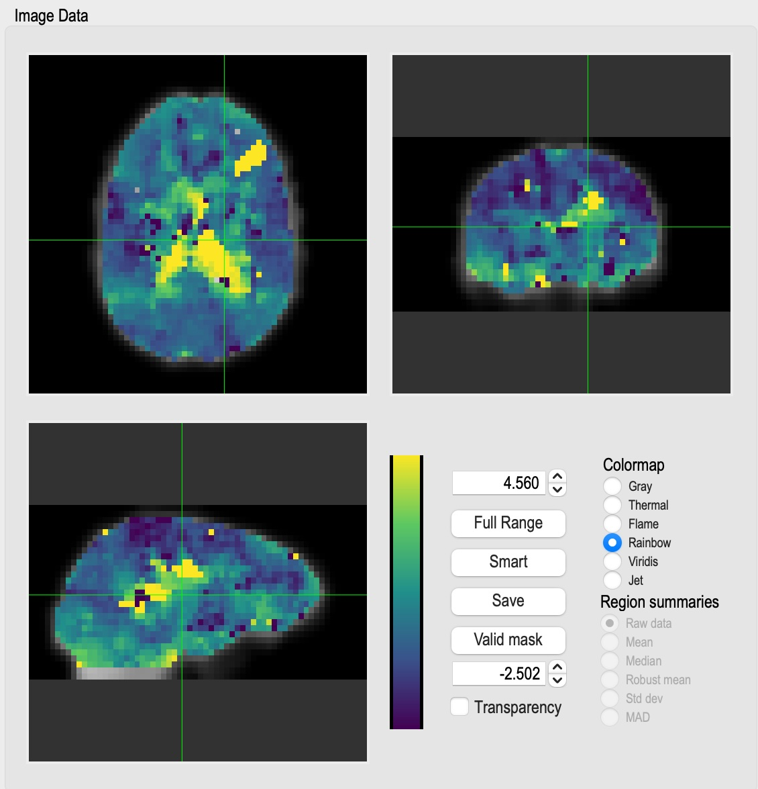
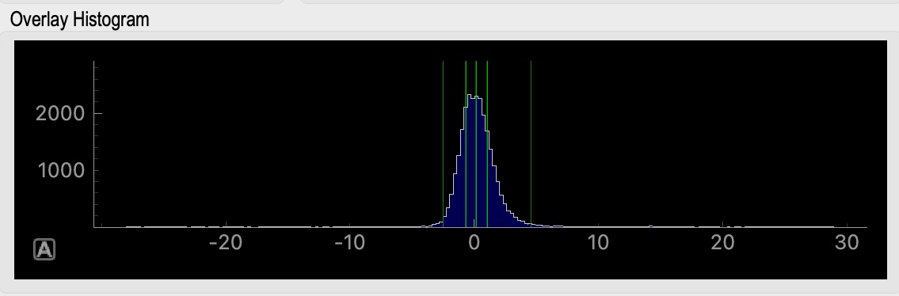
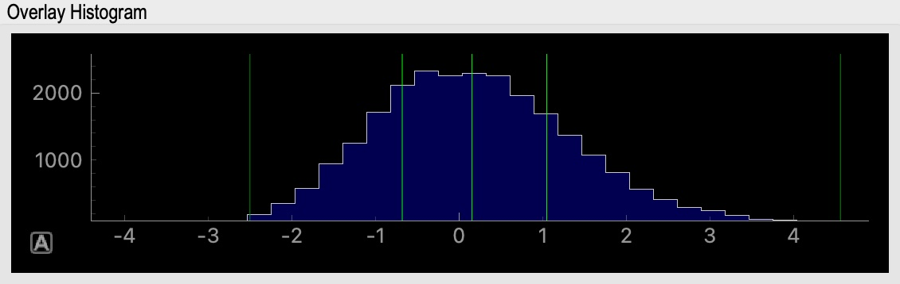

showtc
------

Description:
^^^^^^^^^^^^
	A very simple command line utility that takes a text file
	and plots the data in it in a matplotlib window.  That's it.  A
	good tool for quickly seeing what's in a file.  Has some options
	to make the plot prettier.

Inputs:
^^^^^^^
	Text files containing time series data

Outputs:
^^^^^^^^
	None

Usage:
^^^^^^

.. argparse::
   :ref: rapidtide.workflows.showtc._get_parser
   :prog: showtc
   :func: _get_parser

   Debugging options : @skip
      skip debugging options

glmfilt
-------

Description:
^^^^^^^^^^^^
Uses a GLM filter to remove timecourses (1D text files or 4D NIFTI files) from 4D NIFTI files.

Inputs:
^^^^^^^

Outputs:
^^^^^^^^

Usage:
^^^^^^

.. argparse::
   :ref: rapidtide.workflows.glmfilt._get_parser
   :prog: glmfilt
   :func: _get_parser

   Debugging options : @skip
      skip debugging options

temporaldecomp
--------------

Description:
^^^^^^^^^^^^

Inputs:
^^^^^^^

Outputs:
^^^^^^^^

Usage:
^^^^^^

.. argparse::
   :ref: rapidtide.workflows.niftidecomp._get_parser_temporal
   :prog: temporaldecomp
   :func: _get_parser_temporal

   Debugging options : @skip
      skip debugging options

spatialdecomp
-------------

Description:
^^^^^^^^^^^^

Inputs:
^^^^^^^

Outputs:
^^^^^^^^

Usage:
^^^^^^

.. argparse::
   :ref: rapidtide.workflows.niftidecomp._get_parser_spatial
   :prog: spatialdecomp
   :func: _get_parser_spatial

   Debugging options : @skip
      skip debugging options

polyfitim
---------

Description:
^^^^^^^^^^^^

Inputs:
^^^^^^^

Outputs:
^^^^^^^^

Usage:
^^^^^^

.. argparse::
   :ref: rapidtide.workflows.polyfitim._get_parser
   :prog: polyfitim
   :func: _get_parser

   Debugging options : @skip
      skip debugging options

histnifti
---------

Description:
^^^^^^^^^^^^
	A command line tool to generate a histogram for a nifti file

Inputs:
^^^^^^^
	A nifti file

Outputs:
^^^^^^^^
	A text file containing the histogram information

None

Usage:
^^^^^^

.. argparse::
   :ref: rapidtide.workflows.histnifti._get_parser
   :prog: histnifti
   :func: _get_parser

   Debugging options : @skip
      skip debugging options

showhist
--------

Description:
^^^^^^^^^^^^
	Another simple command line utility that displays the histograms generated by rapidtide.

Inputs:
^^^^^^^
	A textfile generated by rapidtide containing histogram information

Outputs:
^^^^^^^^
	None

Usage:
^^^^^^

	::

		usage: showhist textfilename
			plots xy histogram data in text file

		required arguments:
			textfilename	- a text file containing one timepoint per line

resamp1tc
---------

Description:
^^^^^^^^^^^^
	This takes an input text file at some sample rate and outputs a text file resampled to the specified sample rate.

Inputs:
^^^^^^^

Outputs:
^^^^^^^^

Usage:
^^^^^^

	::

		resamp1tc - resample a timeseries file

		usage: resamp1tc infilename insamplerate outputfile outsamplerate [-s]

		required arguments:
			inputfile        - the name of the input text file
			insamplerate     - the sample rate of the input file in Hz
			outputfile       - the name of the output text file
			outsamplerate    - the sample rate of the output file in Hz

		 options:
			-s               - split output data into physiological bands (LFO, respiratory, cardiac)

resamplenifti
-------------

Description:
^^^^^^^^^^^^
	This takes an input nifti file at some TR and outputs a nifti file resampled to the specified TR.

Inputs:
^^^^^^^

Outputs:
^^^^^^^^

Usage:
^^^^^^

.. argparse::
   :ref: rapidtide.workflows.resamplenifti._get_parser
   :prog: resamplenifti
   :func: _get_parser

   Debugging options : @skip
      skip debugging options

tcfrom3col
----------

Description:
^^^^^^^^^^^^
	A  simple command line that takes an FSL style 3 column regressor file and generates a time course (waveform) file.  FSL 3 column files are text files containing one row per "event".  Each row has three columns: start time in seconds, duration in seconds, and waveform value.  The output waveform is zero everywhere that is not covered by an "event" in the file.

Inputs:
^^^^^^^
	An FSL style three column text file (start time, duration, value)

Outputs:
^^^^^^^^
	A single column text file containing the waveform

Usage:
^^^^^^

.. argparse::
   :ref: rapidtide.workflows.tcfrom3col._get_parser
   :prog: tcfrom3col
   :func: _get_parser

   Debugging options : @skip
      skip debugging options

tcfrom2col
----------

Description:
^^^^^^^^^^^^
	A  simple command line that takes an FSL style 2 column regressor file and generates a time course (waveform) file.  FSL 3 column files are text files containing one row per "event".  Each row has three columns: start time in seconds, duration in seconds, and waveform value.  The output waveform is zero everywhere that is not covered by an "event" in the file.

Inputs:
^^^^^^^
	An FSL style two column text file (start time, duration)

Outputs:
^^^^^^^^
	A single column text file containing the waveform

Usage:
^^^^^^

.. argparse::
   :ref: rapidtide.workflows.tcfrom2col._get_parser
   :prog: tcfrom2col
   :func: _get_parser

   Debugging options : @skip
      skip debugging options

pixelcomp
---------

Description:
^^^^^^^^^^^^
	A program to compare voxel values in two 3D NIFTI files.
        You give pixelcomp two files, each with their own mask.
        Any voxel that has a nonzero mask in both files gets added
        to a list of xy pairs, with the value from the first file being x,
        and the value from the second file being y.  Pixelcomp then:
        1) Makes and displays a 2D histogram of all the xy values. 2) Does a linear
        fit to x and y, and outputs the coefficients (slope and offset)
        to a XXX_linfit.txt file. 3) Writes all the xy pairs to a tab
        separated text file, and 4) Makes a Bland-Altman plot of x vs y

Inputs:
^^^^^^^
	Two 3D NIFTI image files, the accompanying mask files, and the root name for the output files.

Outputs:
^^^^^^^^
	None

Usage:
^^^^^^

	::

		showtc - plots the data in text files

		usage: showtc texfilename[:col1,col2...,coln] [textfilename]... [--nolegend] [--pspec] [--phase] [--samplerate=Fs] [--sampletime=Ts]

		required arguments:
		    textfilename	- a text file containing whitespace separated timecourses, one timepoint per line
				       A list of comma separated numbers following the filename and preceded by a colon is used to select columns to plot

		optional arguments:
		    --nolegend               - turn off legend label
		    --pspec                  - show the power spectra magnitudes of the input data instead of the timecourses
		    --phase                  - show the power spectra phases of the input data instead of the timecourses
		    --transpose              - swap rows and columns in the input files
		    --waterfall              - plot multiple timecourses as a waterfall
		    --voffset=VOFFSET        - plot multiple timecourses as with VOFFSET between them (use negative VOFFSET to set automatically)
		    --samplerate=Fs          - the sample rate of the input data is Fs Hz (default is 1Hz)
		    --sampletime=Ts          - the sample time (1/samplerate) of the input data is Ts seconds (default is 1s)
		    --colorlist=C1,C2,..     - cycle through the list of colors specified by CN
		    --linewidth=LW           - set linewidth to LW points (default is 1)
		    --fontscalefac=FAC       - scale all font sizes by FAC (default is 1.0)
		    --legendlist=L1,L2,..    - cycle through the list of legends specified by LN
		    --tofile=FILENAME        - write figure to file FILENAME instead of displaying on the screen
		    --title=TITLE            - use TITLE as the overall title of the graph
		    --separate               - use a separate subplot for each timecourse
		    --separatelinked         - use a separate subplot for each timecourse, but use a common y scaling
		    --noxax                  - don't show x axis
		    --noyax                  - don't show y axis
		    --starttime=START        - start plot at START seconds
		    --endtime=END            - end plot at END seconds
		    --legendloc=LOC          - Integer from 0 to 10 inclusive specifying legend location.  Legal values are:
					       0: best, 1: upper right, 2: upper left, 3: lower left, 4: lower right,
					       5: right, 6: center left, 7: center right, 8: lower center, 9: upper center,
					       10: center.  Default is 2.
		    --debug                  - print debugging information

glmfilt
---------

Description:
^^^^^^^^^^^^
	Uses a GLM filter to remove timecourses (1D text files or 4D NIFTI files) from 4D NIFTI files.

Inputs:
^^^^^^^

Outputs:
^^^^^^^^

Usage:
^^^^^^

	::

		usage: glmfilt datafile numskip outputroot evfile [evfile_2...evfile_n]
		    Fits and removes the effect of voxel specific and/or global regressors

ccorrica
---------

Description:
^^^^^^^^^^^^
	Find temporal crosscorrelations between all the columns in a text file (for example the timecourse files output by MELODIC.)

Inputs:
^^^^^^^

Outputs:
^^^^^^^^

Usage:
^^^^^^

	::

		ccorrica - find temporal crosscorrelations between ICA components

			usage: ccorrica timecoursefile TR
				timcoursefile:	text file containing multiple timeseries, one per column, whitespace separated
				TR:		the sample period of the timecourse, in seconds

showstxcorr
-----------

Description:
^^^^^^^^^^^^
	Calculate and display the short term crosscorrelation between two timeseries (useful for dynamic correlation).

Inputs:
^^^^^^^

Outputs:
^^^^^^^^

Usage:
^^^^^^

	::

		showstxcorr - calculate and display the short term crosscorrelation between two timeseries

		usage: showstxcorr -i timecoursefile1 [-i timecoursefile2] --samplefreq=FREQ -o outputfile [-l LABEL] [-s STARTTIME] [-D DURATION] [-d] [-F LOWERFREQ,UPPERFREQ[,LOWERSTOP,UPPERSTOP]] [-V] [-L] [-R] [-C] [--nodetrend] [-nowindow] [-f] [--phat] [--liang] [--eckart] [-z FILENAME]

		required arguments:
		    -i, --infile= timcoursefile1     - text file containing one or more timeseries
		    [-i, --infile= timcoursefile2]   - text file containing a timeseries
						       NB: if one timecourse file is specified, each column
						       is considered a timecourse, and there must be at least
						       2 columns in the file.  If two filenames are given, each
						       file must have only one column of data.

		    -o, --outfile=OUTNAME:           - the root name of the output files

		    --samplefreq=FREQ                - sample frequency of all timecourses is FREQ
			   or
		    --sampletime=TSTEP               - time step of all timecourses is TSTEP
						       NB: --samplefreq and --sampletime are two ways to specify
						       the same thing.

		optional arguments:
		    --nodetrend   - do not detrend the data before correlation
		    --nowindow    - do not prewindow data before corrlation
		    --phat        - perform phase alignment transform (PHAT) rather than
				    standard crosscorrelation
		    --liang       - perform phase alignment transform with Liang weighting function rather than
				    standard crosscorrelation
		    --eckart      - perform phase alignment transform with Eckart weighting function rather than
				    standard crosscorrelation
		    -s STARTTIME  - time of first datapoint to use in seconds in the first file
		    -D DURATION   - amount of data to use in seconds
		    -d            - turns off display of graph
		    -F            - filter data and regressors from LOWERFREQ to UPPERFREQ.
				    LOWERSTOP and UPPERSTOP can be specified, or will be calculated automatically
		    -V            - filter data and regressors to VLF band
		    -L            - filter data and regressors to LFO band
		    -R            - filter data and regressors to respiratory band
		    -C            - filter data and regressors to cardiac band
		    -W WINDOWLEN  - use a window length of WINDOWLEN seconds (default is 50.0s)
		    -S STEPSIZE   - timestep between subsequent measurements (default is 25.0s).  Will be rounded to the nearest sample time
		    -f            - negate second regressor

tidepool
--------

Description:
^^^^^^^^^^^^
	Tidepool is a handy tool for displaying all of the various maps generated by rapidtide in one place, overlayed on an anatomic image.  This makes it easier to see how all the maps are related to one another.  To use it, launch tidepool from the command line, navigate to a rapidtide output directory, and then select a lag time (maxcorr) map.  tidpool will figure out the root name and pull in all of the other associated maps, timecourses, and info files.  The displays are live, and linked together, so you can explore multiple parameters efficiently.  Works in native or standard space.

.. image:: images/tidepool_overview.jpg
   :align: center

The main tidepool window with a dataset loaded.

Inputs:
^^^^^^^
        Tidepool loads most of the output files from a rapidtide analysis.  The files must all be in the same directory, and use the naming convention and file formats that rapidtide uses.

Features:
^^^^^^^^^
        There are many panels to the tidepool window.  They are described in detail below.

Image Data
""""""""""

This is the main control of the tidepool window.  This shows three orthogonal views of the active map (maxtime in this case) superimposed on an anatomic image (the mean fmri input image to rapidtide by default).  Use the left mouse button to select a location in any of the images, and the other two will update to match.  The intersecting green lines show the lower left corner of the active location.  The lower righthand panel allows you to adjust various parameters, such as the minimum and maximum values of the colormap (set to the "robust range" by default). The "Transparency" button toggles whether values outside of the active range are set to the minimum or maximum colormap value, or are not displayed.  The radio buttons in the upper right section of the colormap control panel allow you to change to colormap used from the default values.  The "Full Range" button sets the colormap limits to the minimum and maximum values in the map.  The "Smart" button sets the colormap limits to the 2% to 98% limits (the "robust range").  The "Save" button saves the three active images to jpeg files.  The mask button (below the "Smart" button) indicates what mask to apply when displaying the map.  By default, this is the "Valid" mask - all voxels where the rapidtide fit converged.  Right clicking on this button gives you a popup window which allows you to select from several other masks, including no mask, the voxels used to set the initial regressor, the voxels used in the final refinement pass, and a range of significance values for the rapidtide fit.

.. image:: images/tidepool_maskselect.jpg
   :align: center

The popup menu for selecting the display mask.

Overlay Selector
""""""""""""""""
.. image:: images/tidepool_overlayselector.jpg
   :align: center

This panel allows you to select which map is displayed in the "Image Data" panel using the radio buttons in the corner of each image.  The maps displayed will vary based on the analysis performed.  These are all three dimensional maps, with the exception of the bottom map shown - the "Similarity function".  This is the full correlation (or other similarity function) used by rapidtide to generate the various maps.  When this is loaded, you can use the controls in the "Location" panel to select different time points, or to show the function as a movie.

Information panel
"""""""""""""""""
.. image:: images/tidepool_information.jpg
   :align: center

This panel shows the location of the cursor in the "Image Data" panel, and the value of all the loaded maps at that location.  If the rapidtide fit failed at that location, all values will be set to zero, and there will be a text description of the reason for the fit failure.

Histogram
"""""""""

This panel shows the histogram of values displayed (i.e. those selected by the current active mask) in the "Image Data" panel.  By default the range shown is the search range specified during the rapidtide analysis.  You can pand and zoom the histogram by clicking and holding the left or right mouse button and moving the mouse.  The green bars on the graph show the 2%, 25%, 50%, 75%, and 98% percentile values of the histogram.

This shows the result of zooming the histogram using the right mouse button.  With the mouse in the panel, left click on the "A" in the square box in the lower left of the plot to restore the default display values.

Similarity Function
"""""""""""""""""""
.. image:: images/tidepool_similarityfunction.jpg
   :align: center

This panel shows the similarity function (correlation, mutual information) at the location of the cursor in the "Image Data" window.  There is a marker showing the maxtime and maxcorr found by the fit (or the text "No valid fit" if the fit failed).  This can be used for diagnosing strange fit behavior.

Probe Regressor
"""""""""""""""
.. image:: /images/tidepool_proberegressor.jpg
   :align: center

This panel shows the probe regressor used in various stages of the rapidtide analysis.  The left panel shows the time domain, the right shows the frequency domain, with a translucent green overlay indicating the filter band used in the analysis. The radio buttons on the right select which analysis stage to display: "Prefilt" is the initial probe regressor, either the global mean, or an externally supplied timecourse; "Postfilt" is this regressor after filtering to the active analysis band.  "PassX" is the resampled regressor used in each of the analysis passes.

Usage:
^^^^^^
    If tidepool is called without arguments, a dialog box will appear to allow you to select the maxtime map from the dataset you want to load.  This (and other things) can alternately be supplied on the command line as specified below.

.. argparse::
   :ref: rapidtide.workflows.tidepool._get_parser
   :prog: tidepool
   :func: _get_parser

