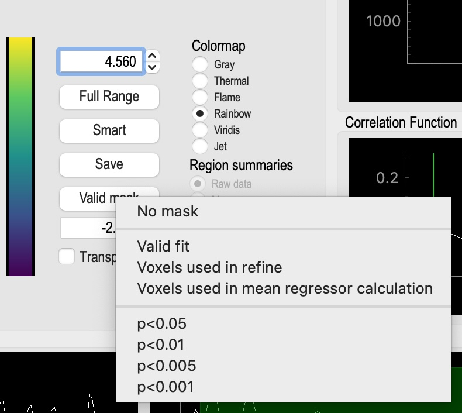

tidepool
--------

Description:
^^^^^^^^^^^^
	Tidepool is a handy tool for displaying all of the various maps generated by rapidtide in one place, overlayed on an anatomic image.  This makes it easier to see how all the maps are related to one another.  To use it, launch tidepool from the command line, navigate to a rapidtide output directory, and then select a lag time (maxcorr) map.  tidpool will figure out the root name and pull in all of the other associated maps, timecourses, and info files.  The displays are live, and linked together, so you can explore multiple parameters efficiently.  Works in native or standard space.

.. image:: images/tidepool_overview.jpg
   :align: center

The main tidepool window with a dataset loaded.

Inputs:
^^^^^^^
        Tidepool loads most of the output files from a rapidtide analysis.  The files must all be in the same directory, and use the naming convention and file formats that rapidtide uses.

Features:
^^^^^^^^^
        There are many panels to the tidepool window.  They are described in detail below.

Image Data
""""""""""
.. image:: images/tidepool_orthoimage.jpg
   :align: center

This is the main control of the tidepool window.  This shows three orthogonal views of the active map (maxtime in this case) superimposed on an anatomic image (the mean fmri input image to rapidtide by default).  Use the left mouse button to select a location in any of the images, and the other two will update to match.  The intersecting green lines show the lower left corner of the active location.  The lower righthand panel allows you to adjust various parameters, such as the minimum and maximum values of the colormap (set to the "robust range" by default). The "Transparency" button toggles whether values outside of the active range are set to the minimum or maximum colormap value, or are not displayed.  The radio buttons in the upper right section of the colormap control panel allow you to change to colormap used from the default values.  The "Full Range" button sets the colormap limits to the minimum and maximum values in the map.  The "Smart" button sets the colormap limits to the 2% to 98% limits (the "robust range").  The "Save" button saves the three active images to jpeg files.  The mask button (below the "Smart" button) indicates what mask to apply when displaying the map.  By default, this is the "Valid" mask - all voxels where the rapidtide fit converged.  Right clicking on this button gives you a popup window which allows you to select from several other masks, including no mask, the voxels used to set the initial regressor, the voxels used in the final refinement pass, and a range of significance values for the rapidtide fit.

The popup menu for selecting the display mask.

Overlay Selector
""""""""""""""""
.. image:: images/tidepool_overlayselector.jpg
   :align: center

This panel allows you to select which map is displayed in the "Image Data" panel using the radio buttons in the corner of each image.  The maps displayed will vary based on the analysis performed.  These are all three dimensional maps, with the exception of the bottom map shown - the "Similarity function".  This is the full correlation (or other similarity function) used by rapidtide to generate the various maps.  When this is loaded, you can use the controls in the "Location" panel to select different time points, or to show the function as a movie.

Information panel
"""""""""""""""""
.. image:: images/tidepool_information.jpg
   :align: center

This panel shows the location of the cursor in the "Image Data" panel, and the value of all the loaded maps at that location.  If the rapidtide fit failed at that location, all values will be set to zero, and there will be a text description of the reason for the fit failure.

Histogram
"""""""""
.. image:: images/tidepool_overlayhistogram.jpg
   :align: center

This panel shows the histogram of values displayed (i.e. those selected by the current active mask) in the "Image Data" panel.  By default the range shown is the search range specified during the rapidtide analysis.  You can pand and zoom the histogram by clicking and holding the left or right mouse button and moving the mouse.  The green bars on the graph show the 2%, 25%, 50%, 75%, and 98% percentile values of the histogram.

.. image:: images/tidepool_histogramzoomed.jpg
   :align: center

This shows the result of zooming the histogram using the right mouse button.  With the mouse in the panel, left click on the "A" in the square box in the lower left of the plot to restore the default display values.

Similarity Function
"""""""""""""""""""
.. image:: images/tidepool_similarityfunction.jpg
   :align: center

This panel shows the similarity function (correlation, mutual information) at the location of the cursor in the "Image Data" window.  There is a marker showing the maxtime and maxcorr found by the fit (or the text "No valid fit" if the fit failed).  This can be used for diagnosing strange fit behavior.

Probe Regressor
"""""""""""""""
.. image:: /images/tidepool_proberegressor.jpg
   :align: center

This panel shows the probe regressor used in various stages of the rapidtide analysis.  The left panel shows the time domain, the right shows the frequency domain, with a translucent green overlay indicating the filter band used in the analysis. The radio buttons on the right select which analysis stage to display: "Prefilt" is the initial probe regressor, either the global mean, or an externally supplied timecourse; "Postfilt" is this regressor after filtering to the active analysis band.  "PassX" is the resampled regressor used in each of the analysis passes.

Usage:
^^^^^^
    If tidepool is called without arguments, a dialog box will appear to allow you to select the maxtime map from the dataset you want to load.  This (and other things) can alternately be supplied on the command line as specified below.

.. argparse::
   :ref: rapidtide.workflows.tidepool._get_parser
   :prog: tidepool
   :func: _get_parser

